# B2B Smart Ordering System – Admin Dashboard

[](https://github.com/ibrahem137/b2b-smart-ordering-admin-dashboard/actions/workflows/flutter_ci.yml)

A Flutter-based admin dashboard for a B2B smart ordering platform designed for supermarkets and suppliers.

The dashboard provides centralized management for suppliers, categories, products, supplier offers, purchase orders, sales, and business analytics.

## Features

- Admin authentication
- Dashboard overview and analytics
- Supplier management
- Supplier category assignment
- Category management with custom colors
- Master product management
- Supplier product offers
- Purchase order management
- Sales monitoring and profit tracking
- Search and filtering
- Light / Dark / System theme support
- Responsive desktop and web interface
- Secure token-based authentication
- REST API integration

## Tech Stack

- Flutter
- Dart
- Cubit / Bloc
- Dio
- Retrofit
- Freezed
- JSON Serializable
- GetIt
- Shared Preferences
- Flutter Secure Storage
- FL Chart
- SidebarX
- Material 3

## Architecture

The project follows a feature-based architecture with separated layers for:

- Data
- Domain
- Presentation
- Networking
- Dependency Injection
- Routing
- Theme Management

Example structure:

```text
lib/
├── core/
│   ├── di/
│   ├── networking/
│   ├── router/
│   ├── services/
│   ├── theme/
│   └── widgets/
│
├── screens/
│   ├── auth/
│   ├── dashboard/
│   ├── suppliers/
│   ├── categories/
│   ├── master_products/
│   ├── supplier_products/
│   ├── orders/
│   ├── sales/
│   └── settings/
│
└── main.dart
```

## Screenshots

### Admin Login

<p align="center">
  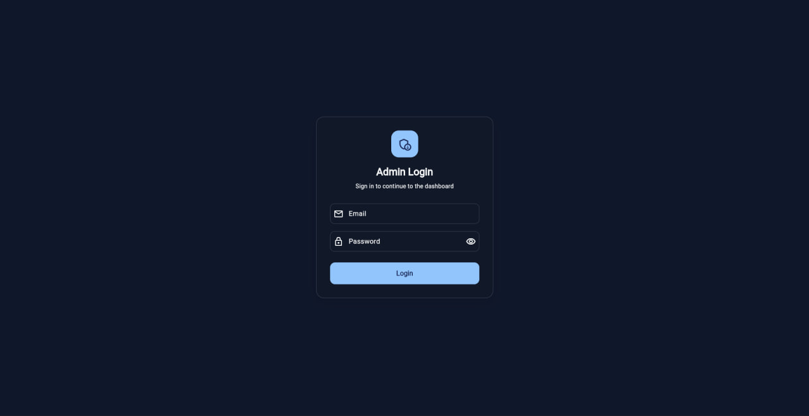
</p>

### Dashboard

| Dark Mode | Light Mode |
| --- | --- |
| 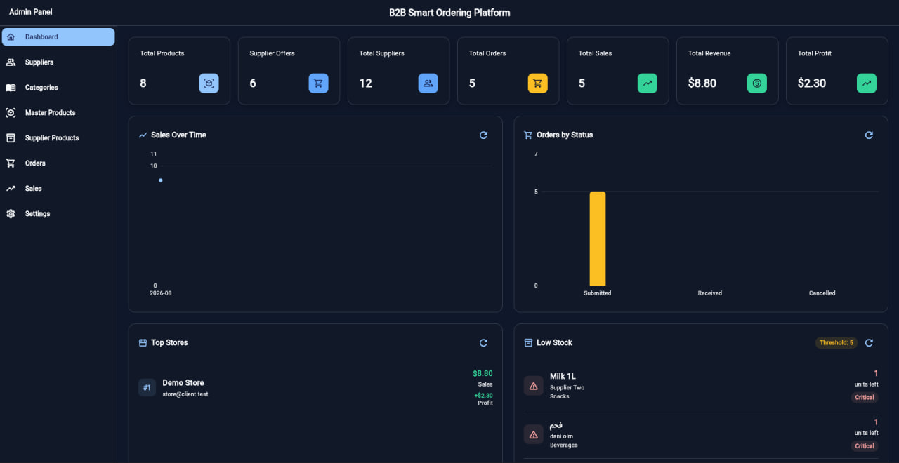 | 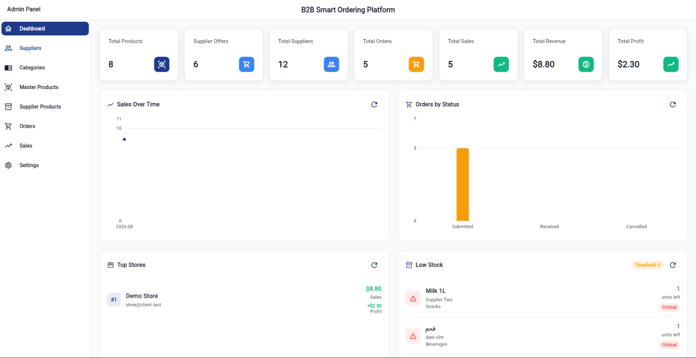 |

### Suppliers Management

| Dark Mode | Light Mode |
| --- | --- |
| 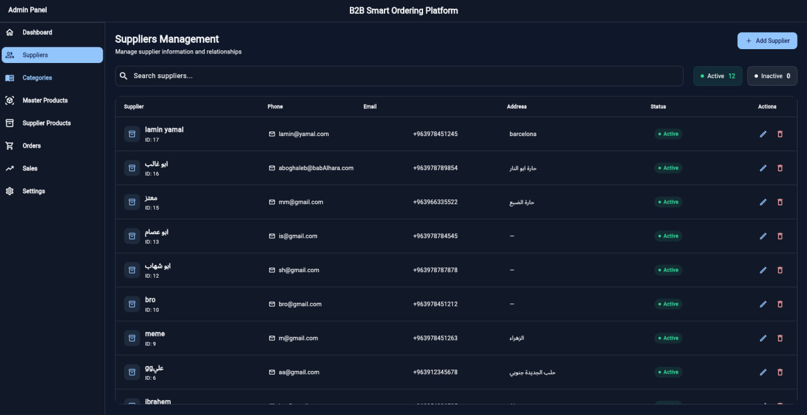 | 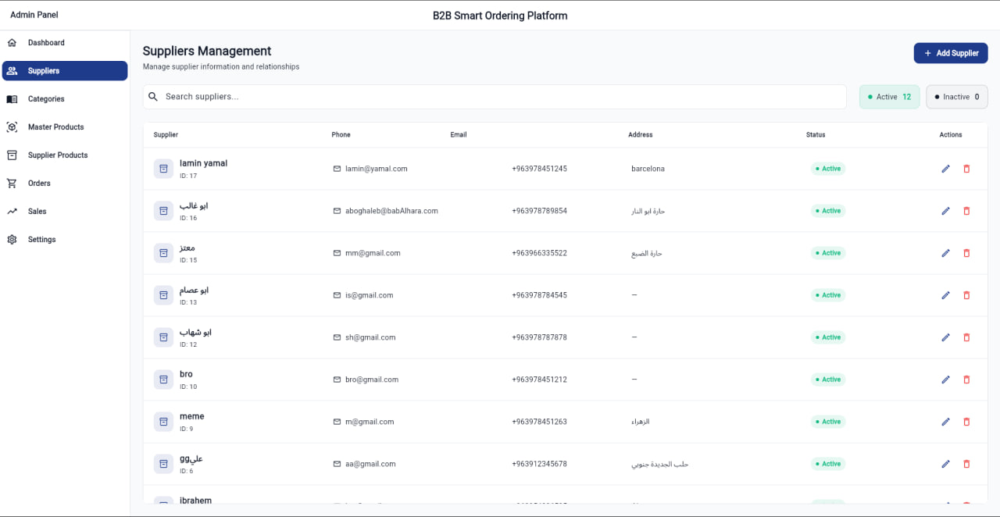 |

### Add Supplier

| Dark Mode | Light Mode |
| --- | --- |
| 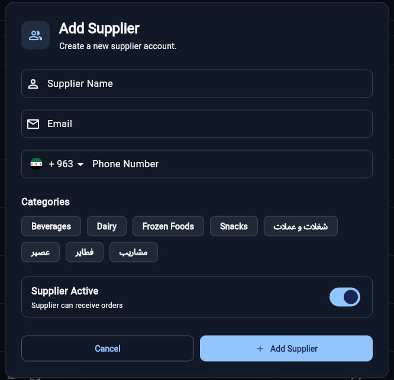 | 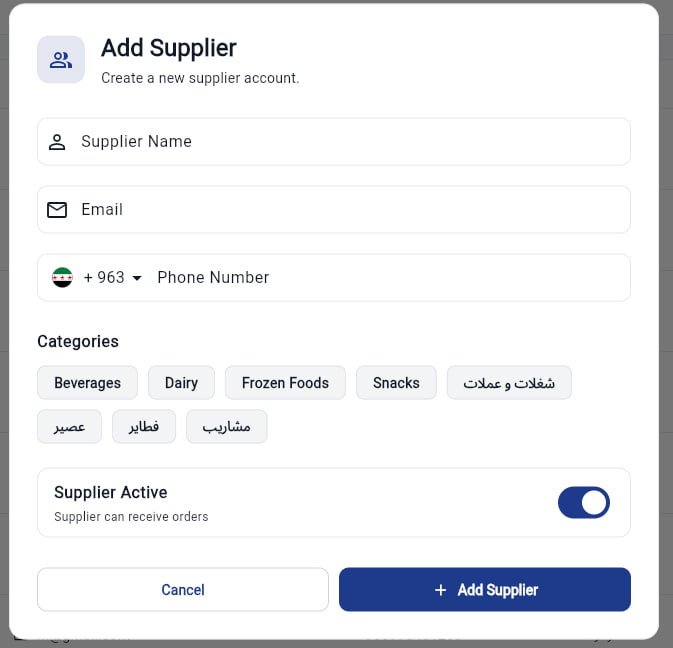 |

### Categories Management

| Dark Mode | Light Mode |
| --- | --- |
| 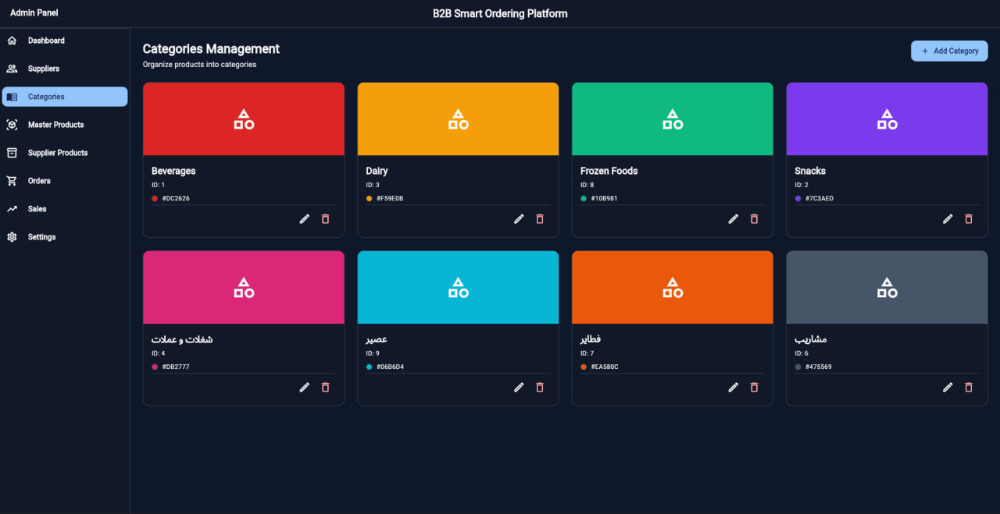 | 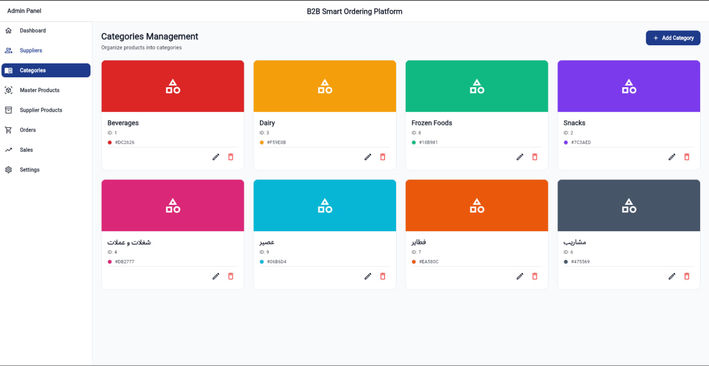 |

### Master Products

| Dark Mode | Light Mode |
| --- | --- |
| 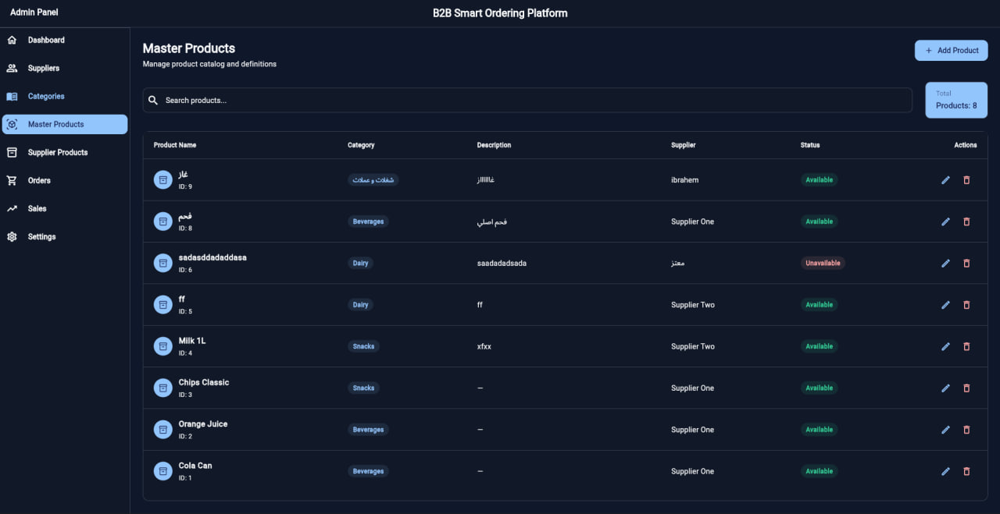 | 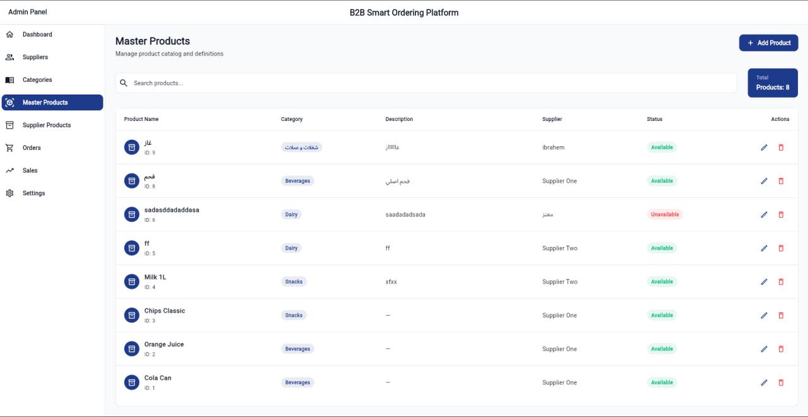 |

### Supplier Products

| Dark Mode | Light Mode |
| --- | --- |
| 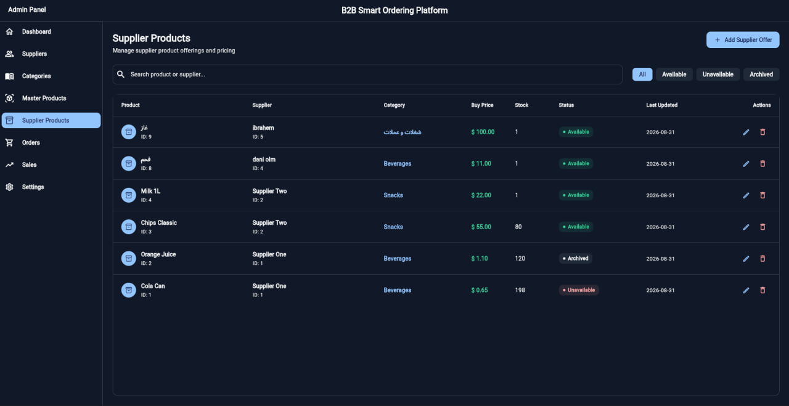 | 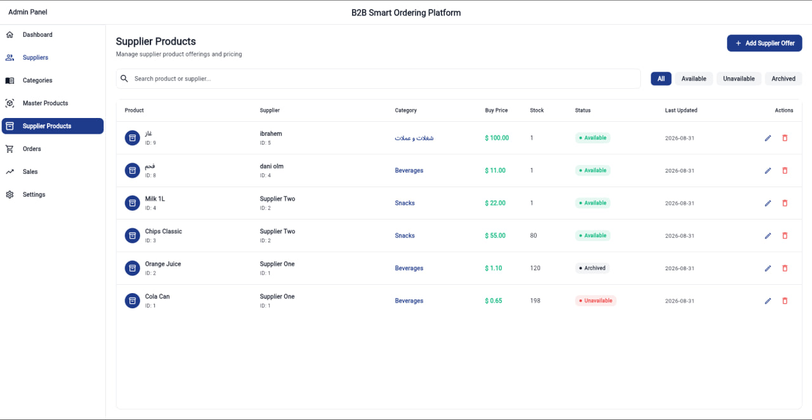 |

### Purchase Orders

| Dark Mode | Light Mode |
| --- | --- |
| 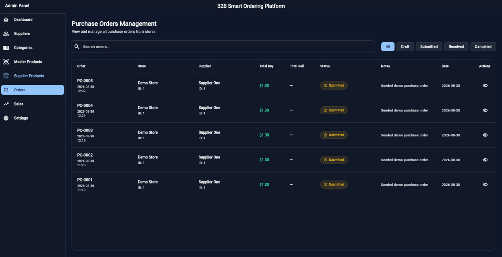 | 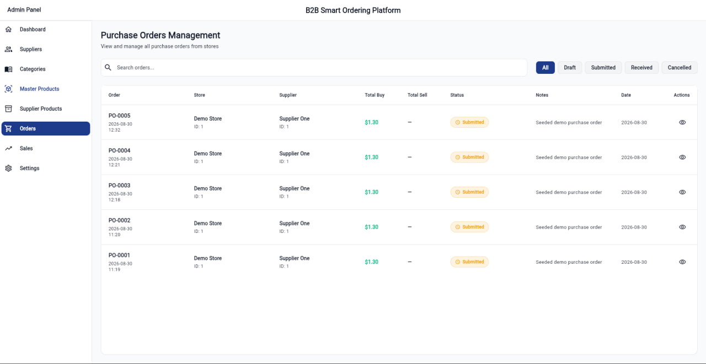 |

### Sales Management

| Dark Mode | Light Mode |
| --- | --- |
| 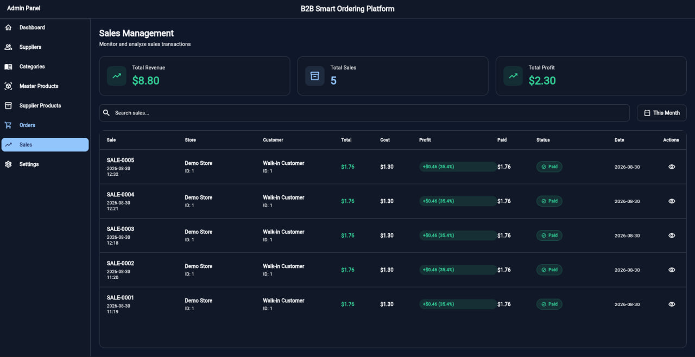 | 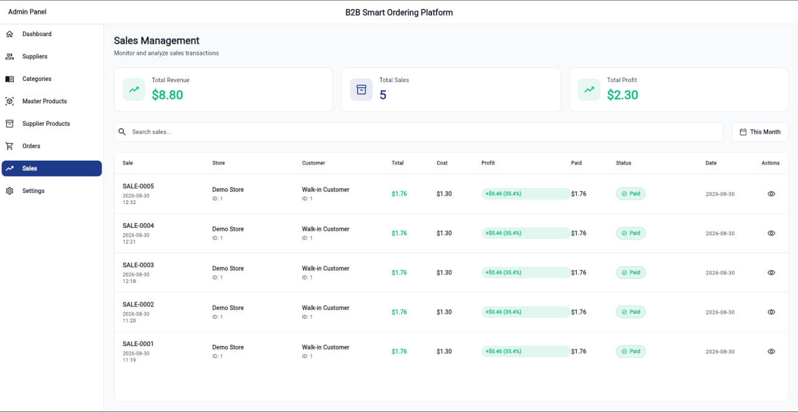 |